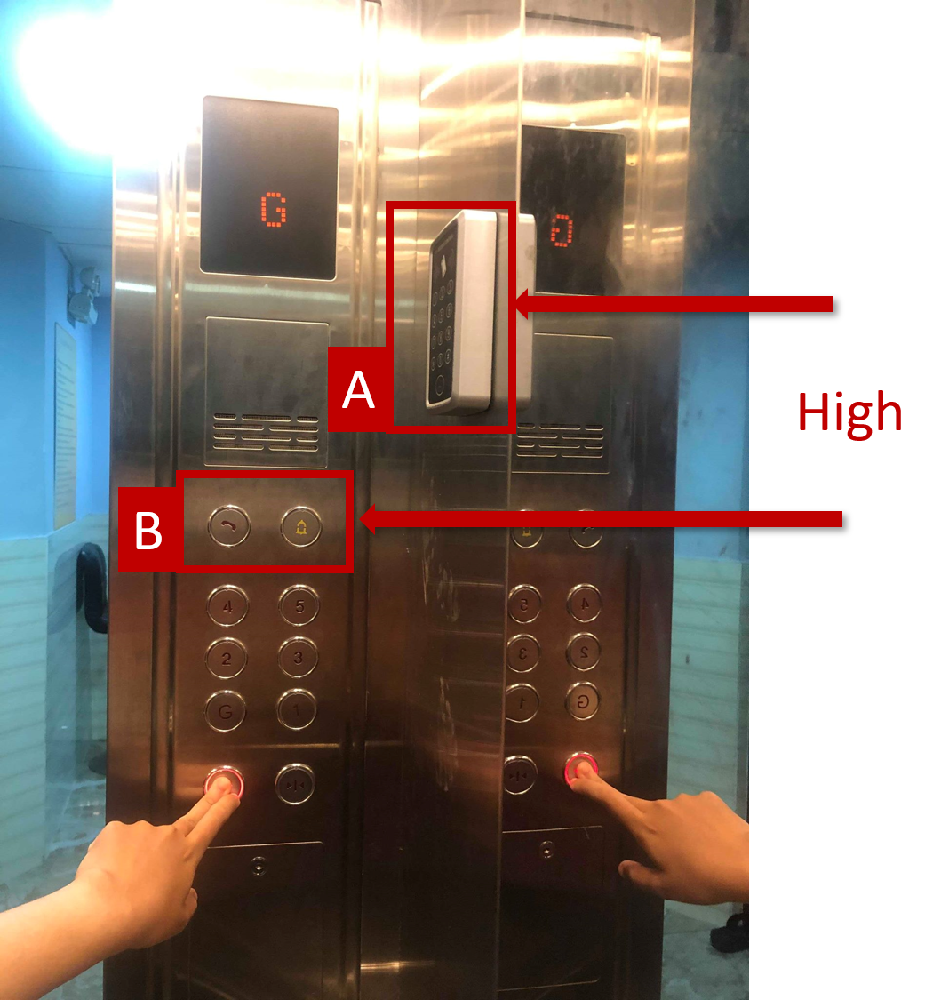
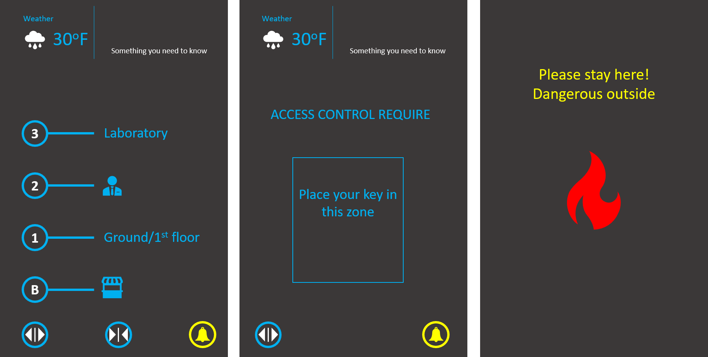

# A-ELEVATOR: Design and Build elevator using Aframe 

* [DEMO](https://zipexpo.github.io/hw1.62.Nguyen/demo.html)
* [Technology: A-FRAME](https://aframe.io/)

## Content:

* [Old design](#old-elevator)
* [New Design & brain storm](#new-design)
* [Application & feature](#application-and-features)

### Old Elevator
Almost all apartment in Ho Chi Minh city in VietName has an elevator like this:

These elevator quite easy to use exccept the security scan don't give much feed back (when scan wrong) and the place of security scanner quite high (not suitable for the handicap)-box A

### New design
Thus, I come up with new design which combine the security scan (box A in old design) into one with control pannel using touch screen.

All button have been layout with extra information about the floor in the building along with the display 3D of basic structure of that floor.

Due to the touch screen hard to giving physical feed back to user (which can be found when you press the button). I choose the feed back by image and voice. I also consider about using voice comand , however, It may not work well for diffrent people, different accent and country.

Additionally, I relocate the box B in old design lower

### Application and Features
[**VR** or Virtual reality is helpfull in architecture when we want to see the instance 3D in the environment and experience by your self before making it to the reality. Therefore, I chose to implement the elevator in web VR with [**a-frame**](https://aframe.io/) and [**javascript**](https://www.javascript.com/)

